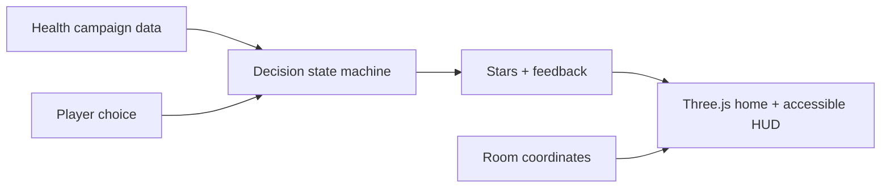

# Architecture

The domain layer has no dependency on Three.js or browser APIs. A later Filament renderer can consume the same campaign and decision contract.

## Safety properties

- Wrong choices never present illness as punishment or moral failure.
- Medicine scenarios always route the child to a trusted adult.
- The foundation build stores no names, ages, health history, or behavior profiles.
- New missions require a learning objective, correct action, clear explanation, and tests.
