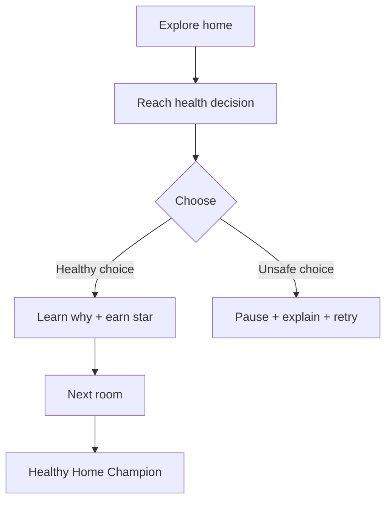

# KidSim: Healthy Home Adventure

KidSim is a Three.js health-education game set inside one continuous virtual home. The player guides a child avatar through everyday decisions, sees immediate consequences, and earns a star for each safe choice.

## Foundation campaign

1. **Clean hands:** leave the toilet, notice the meal, and wash with soap before eating.
2. **Medicine safety:** find an unknown tablet and involve a trusted adult.
3. **Cough care:** cover a cough with the inside of the elbow and protect a nearby friend.



The game is deliberately one integrated campaign, not separate mini-projects. Three.js renders the home and avatar. A framework-independent state machine keeps progress, decisions, feedback, and assessment testable.

## Run and test

```bash
npm start
npm test
npm run check
```

## Product principles

- use positive, age-appropriate explanations
- avoid shame and graphic health consequences
- collect no personal data in the client-only foundation build
- support guided learning with parents, teachers, or health educators
- test every right/wrong decision route
- design a future non-3D accessibility mode

## Roadmap

- child and educator usability research
- narration, captions, localization, and dyslexia-friendly display options
- safe water, oral hygiene, food handling, first aid, and medicine-storage missions
- teacher dashboard using anonymous session summaries
- curriculum and public-health review
- optional Filament renderer for high-performance native devices

## License

MIT. Health-learning content should be professionally reviewed before classroom deployment.
